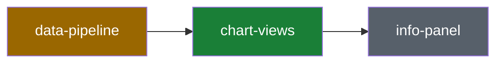

# System recap (visual plan / visual recap)

Produce a high-altitude, visual review aid directly in the PR description. No
deployment, no third-party service: GitHub renders the block (including
mermaid diagrams), and the PR itself is the storage.

The recap is informational and non-blocking. It supplements the PR
description and normal code review; it never replaces reading the diff.

## Two modes, one format

- **Plan mode** (before/while implementing): describe the intended change
  against the current system. If no PR exists yet, put the block in the plan
  document (e.g. `specs/NNN-*/plan.md`) or a message; move it into the PR
  description once the PR exists.
- **Recap mode** (PR creation and every meaningful update): describe what the
  diff actually does. Replaces a plan-mode block if one exists.

## Source-of-truth rules (non-negotiable)

1. **Recap mode reads the diff, not memory.** Generate the recap from
   `git diff main...HEAD` (plus `git diff main...HEAD --stat`). Session
   context may explain intent, but every claim about what changed must be
   checkable against the diff.
2. **Classification is checked against the primitives map.** Read
   [`docs/primitives.yaml`](../../../docs/primitives.yaml) before
   classifying. Use its `id` values verbatim in the block.
3. **The map stays current.** If the PR adds, removes, or materially
   reshapes a primitive, update `docs/primitives.yaml` in the same PR and say
   so in the block. Ordinary feature work should not touch it.
4. **`legacy-chart-engine` is a frozen, archived reference.** It's no longer in
   the working tree — preserved as `archive/legacy-site.tar.gz` — so a diff
   shouldn't touch it at all; if one does (e.g. re-archiving after an
   edit), that's `extends` at most, never `adds`.
5. **Data files under `web/data/` and `web/hist/` are data, not code, and
   are never `adds`.** No primitive's `code:` root covers them — they're the
   hardware-pushed/backfilled archive itself, not application logic.
   Classify a diff touching them against whichever primitive's _logic_
   produced the change: `extends` against `offline-data-tools` when a
   backfill/migration script wrote them, or `composes` for a routine
   hardware-pushed update passing through unchanged. See the
   `pushed-data-is-source-of-truth` invariant in `docs/primitives.yaml`.

## Risk classification

Classify each touched primitive, then roll up to the highest severity as the
overall classification (`adds` > `extends` > `composes`):

| Classification | Meaning                                                    | Risk   |
| -------------- | ---------------------------------------------------------- | ------ |
| `composes`     | Uses existing primitives as-is; wiring and call sites only | Low    |
| `extends`      | Changes a primitive's behavior, shape, or contract         | Medium |
| `adds`         | Introduces a new primitive (must update `primitives.yaml`) | High   |

If the diff touches an `invariants:` entry from `docs/primitives.yaml`, call
it out explicitly in the block's Invariants section regardless of overall
risk — invariant breaks (e.g. treating a derived/backfilled file as if it
were the source of truth) are worth flagging even in an otherwise low-risk
PR.

## Block format

The block lives between HTML comment markers as a normal `## System Recap`
section — a peer of the PR description's other `##` sections (e.g.
`## Summary`, `## What changed`), not a single giant collapsed blob. Each
topic underneath gets its own `###` heading with its content individually
collapsed behind a generic "Show more" `<details>`, so the section skims like
the rest of the description and only expands what the reader asks for.

Fixed section order:

- `## System Recap` — one-line classification summary, bolded, plus
  `**Mode:**` and, in recap mode, `**Base:**`/`**Head:**` commit refs, all in
  plain (uncollapsed) text
- `### Primitives touched` — collapsed: table of `id`, `group`, and
  per-primitive impact
- `### System map` — collapsed: mermaid flowchart, color-coded by
  touched/extended/added/untouched
- Optional, same pattern: `### Change flow`, `### Before / after`,
  `### Invariants`, `### Plan vs actual`

Formatting rules: blank lines around every fenced block (required for GitHub
to render mermaid); quote node labels containing spaces; keep the overall
risk word bolded in the summary line; use primitive `id`s verbatim, never
their `name`; every `<details>` uses the literal summary text `Show more` —
don't customize it per section. Write fences as literal triple backticks —
never backslash-escape them (`` \`\`\` ``) when composing the block in your
own reasoning/response text and then transcribing it into the scratch file,
since an escaped fence renders as flat text instead of a code block. The
Artifact preview step exists specifically to catch this before it reaches
the PR — check the mermaid diagram and any before/after blocks actually
render as blocks, not as a single line of literal backticks, before asking
for confirmation.

````markdown
<!-- system-recap:start -->

## System Recap

**Classification:** composes existing primitives (low risk) — no primitives
added or changed; this PR wires existing primitives together.

**Mode:** recap · **Base:** `main` @ `abc1234` · **Head:** `def5678`

### Primitives touched

<details>
<summary>Show more</summary>

| Primitive       | Group     | Impact                                       |
| --------------- | --------- | -------------------------------------------- |
| `chart-views`   | rendering | composes                                     |
| `data-pipeline` | data      | extends — new `efficiency` field on readings |

</details>

### System map

<details>
<summary>Show more</summary>



</details>

### Change flow

<details>
<summary>Show more</summary>

_Optional: a mermaid flowchart or sequence diagram of the specific change._

</details>

### Before / after

<details>
<summary>Show more</summary>

_Optional: data-format, API shape, or route changes as compact before/after
fenced blocks or tables._

</details>

### Invariants

<details>
<summary>Show more</summary>

_Optional: only when the change touches an invariant from `primitives.yaml`._

</details>

### Plan vs actual

<details>
<summary>Show more</summary>

_Recap mode only, when a plan-mode block existed: what shipped as planned and
what drifted, in a short list._

</details>

<!-- system-recap:end -->
````

## Workflow

**Recap mode (creating/updating a PR):**

This project's usual flow is: push the branch, run `generate-pr` for a
title/description, paste that into github.com to create the PR by hand — so
there is usually no PR number in hand when this skill runs. That's fine:
`gh pr view`/`gh pr edit`, and the upsert script below, all resolve to the
PR belonging to the _currently checked-out branch_ when no number is given.
Only pass an explicit `<pr-number>` when operating on a branch other than
the one checked out locally.

1. Read `docs/primitives.yaml`.
2. Run `git diff main...HEAD --stat` and `git diff main...HEAD` to gather
   facts; run `gh pr view --json number,baseRefName,headRefOid,body` for PR
   metadata if a PR already exists (add a number/URL argument only if
   targeting a non-current branch).
3. Map changed paths to primitive `code:` roots (longest-prefix match) and
   classify each touched primitive.
4. Author the block following the template above and write it to a scratch
   file in the session scratchpad directory (never inside the repo — nothing
   here needs to be gitignored or committed).
5. **Preview it before posting.** Wrap the block in a minimal Markdown file
   and publish it with the `Artifact` tool — Artifacts render Markdown and
   Mermaid natively, so this is the closest private, no-side-effect preview
   of how the block will actually look on GitHub. Check the diagram renders
   and the table doesn't wrap awkwardly, then iterate before touching the PR.
   **Publishing does not show it to the user by itself** — the tool only
   returns a URL to you. You must paste that link into your reply and ask
   the user to open and review it.
6. **Stop and wait for explicit confirmation.** Posting to a PR is
   outward-facing and visible to any collaborator, so do not run step 7
   until the user has reviewed the preview link from step 5 and explicitly
   says to go ahead (e.g. "looks good, post it"). Re-publish and re-share
   the link on every revision the user asks for; do not treat silence, a
   previous unrelated approval, or "the block looks right to me" (said by
   you, not the user) as consent.
7. Once confirmed, upsert the block into the PR description:
   ```bash
   node .claude/skills/visual-recap/scripts/upsert-recap-block.mjs <block-file>
   # or, targeting a specific PR explicitly:
   node .claude/skills/visual-recap/scripts/upsert-recap-block.mjs <pr-number> <block-file>
   ```
8. Re-run after significant follow-up commits — the script replaces the
   previous block in place rather than duplicating it. Treat this as a new
   post: re-preview (step 5) and get fresh confirmation (step 6) before
   re-upserting, even if an earlier revision was already approved.

**Plan mode (before implementation):**

Same steps 1–5 (the Artifact preview is just as useful before the diff
exists), but:

- Use `**Mode:** plan` and omit `**Base:**`/`**Head:**`.
- Describe _intended_ impact, not diff-derived facts.
- If no PR exists yet, put the block at the top of the feature's
  `specs/NNN-*/plan.md` instead of running the upsert script (steps 7–8) —
  that's a normal file edit, not a PR post, so the step 6 confirmation gate
  only applies once you're actually about to run the upsert script against a
  real PR.
- Note explicitly when no primitive changes are expected.
- Once the PR exists and recap mode runs, add a **Plan vs actual** section
  recording any drift from the plan-mode block.

The block is informational — it supplements but never replaces reading the
diff or normal code review.
